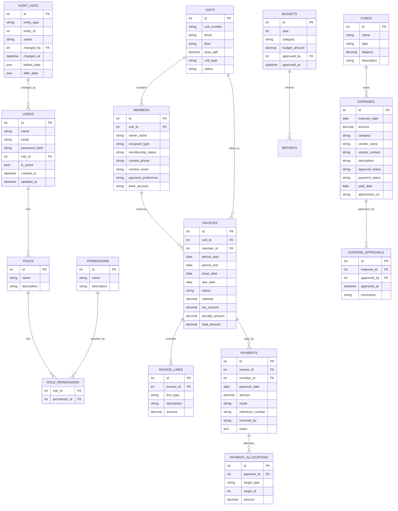

# Residential Cooperative Finance System - Combined Design Document

## 1. Recommended Architecture

- Web application with:
  - Frontend UI: modern SPA (React / Vue / Angular)
  - Backend API: REST or GraphQL service
  - Database: relational DB (PostgreSQL / MySQL / SQL Server)
- Deploy as:
  - cloud-hosted or on-premise server
  - containerized service (Docker)
- Key layers:
  - Presentation
  - Business logic
  - Data access
  - Audit/security

---

## 2. Core Modules

1. **Unit / Member Management**
   - Unit registry
   - Member profile
  - Occupant type, bank/payment preference
   - Search/filter by unit, owner, status

2. **Maintenance Billing & Invoice Engine**
   - Billing cycles: monthly / quarterly / annual
   - Charge calculation: flat type / area / levies
   - Automatic invoice generation
   - Penalty/late-fee posting

3. **Payment Recording & Allocation**
   - Payment capture: date, amount, mode, reference
   - Allocation rules: current dues, arrears, penalties, funds
   - Immediate ledger update
   - Receipt generation

4. **Expense Tracking**
   - Expense creation/editing
   - Vendor details, category, approval workflow
   - Payment status and fund impact

5. **Budgeting & Forecasting**
   - Annual budgets by category
   - Actual vs budget tracking
   - Remaining fund and cash flow projections

6. **Receivables / Payables**
   - Outstanding dues dashboard
   - Vendor payables with due dates
   - Filtered collection/payable reports

7. **Reporting & Dashboard**
   - Collection summaries
   - Expense by category
   - Arrears statement
   - Unit-wise outstanding report
   - Cash flow / P&L / bank reconciliation
   - Exports: PDF, Excel

8. **Notifications & Communication**
   - Due/overdue reminders
   - Receipt acknowledgements
   - Notices for charges and announcements

9. **Audit & History**
   - Transaction audit trail
   - Change history for invoices/payments/expenses
   - User identity, timestamp, before/after values

---

## 3. Data Model Suggestions

Recommended entities:

- `User`
  - id, name, email, role
- `Role`
  - admin, treasurer, auditor, member
- `Permission`
  - create/update/delete/read by module
- `Unit`
  - unit_number, block, floor, area, status
- `Member`
  - owner_name, occupant_type, contact, membership_status, payment_preference, unit_id
- `Invoice`
  - unit_id, period_start, period_end, due_date, status, total_amount, tax, penalty_amount
- `InvoiceLine`
  - invoice_id, type, description, amount
- `Payment`
  - invoice_id, member_id, date, amount, mode, reference, allocated_to
- `Allocation`
  - payment_id, target_type, target_id, amount
- `Expense`
  - date, amount, category, vendor, status, approval_status, supporting_documents
- `Budget`
  - year, category, amount, approved_by
- `Fund`
  - type, balance, description
- `Receivable`
  - computed view from unpaid invoices
- `Payable`
  - computed view from unpaid expenses
- `AuditLog`
  - entity_type, entity_id, action, changed_by, changed_at, before, after

---

## 4. Implementation Details

#### Billing and Invoicing
- Store standard maintenance template per unit type
- Support variable levies:
  - water / electricity
  - sinking fund / repair fund
- Handle billing frequency:
  - monthly = generate 12 invoices/year
  - quarterly = generate 4 invoices/year
  - annual = generate 1 invoice/year
- Overdue logic:
  - apply penalty after due date
  - recalculate on payment entry

#### Payment Allocation
- Allocation strategy:
  1. current dues
  2. arrears
  3. penalties
  4. fund contributions
- Store allocations explicitly so each payment can be audited
- Use database transaction to update invoice and ledger atomically

#### Expense Workflow
- States: draft → pending approval → approved → paid
- Category mapping for budgets
- Vendor details and attachments
- When expense is paid, debit society cash/fund balance

#### Budgeting & Forecasting
- Track actual spend per category
- Show variance = budget - actual
- Use rolling forecast based on committed expenses and expected collections

---

## 5. Security & Non-Functional Design

#### Authentication / Authorization
- Secure login with hashed passwords or SSO
- Enforce RBAC:
  - Admin: full config + user management
  - Treasurer: payments/expenses/reports
  - Auditor: view-only financial history
  - Member: optional portal access
- Protect APIs with token-based auth or session auth

#### Implemented Role Access Matrix (Current Application)

| Role | Units | Members | Maintenance Templates | Invoices | Payments | Audit Logs | Users and Roles | Special Workflow Access |
|---|---|---|---|---|---|---|---|---|
| Admin | View, Create, Edit, Delete, Bulk Import | View, Create, Edit, Delete, Transfer, Bulk Import | View, Create, Edit, Delete templates/levies | View, Generate, Penalty, Delete (single/bulk/filtered) | View/Create/Manage | View | Full user management (create/update/delete), plus profile/role setup | Can review Treasurer paid-invoice deletion requests |
| Treasurer | View only | View, Create, Edit, Delete, Transfer, Bulk Import | View only (API read allowed; UI create/edit is admin-only) | View, Generate, Penalty, Delete (single/bulk/filtered) | View/Create/Manage | View | No user management | Can review Admin paid-invoice deletion requests |
| Board Member | View only | View, Create, Edit, Delete, Transfer, Bulk Import | View only | View only (list/detail) | No access | No access | No access | No approval-task review |
| Auditor | View only | View only | View only | API read allowed; no invoice UI route configured | No access | View | No access | No approval-task review |
| Member | View only | View only | View only | API read allowed; no invoice UI route configured | No access | No access | No access | No approval-task review |

Notes:
- View only on Units, Members, and Maintenance Templates is available to authenticated users at API level.
- Unit create/update/delete is Admin only.
- Invoice and Payment write operations are Admin and Treasurer only.
- Paid invoice deletion uses cross-role approval:
  - Treasurer request -> Admin review
  - Admin request -> Treasurer review

#### Data Integrity
- Use strong validation for all amounts, dates, references
- Enforce database constraints:
  - non-null fields
  - foreign keys
  - unique unit/member identifiers

#### Reliability
- Use ACID transactions for:
  - payment posting
  - invoice generation
  - expense status update
- Schedule backups and provide restore process
- Implement soft delete or archive for audit compliance

#### Performance
- Index searches on:
  - unit_number
  - owner_name
  - invoice status
  - payment date
- Cache dashboard totals if needed
- Paginate large reports

---

## 6. Suggested Technology Stack

Option 1: Modern web stack
- Frontend: React / Vue
- Backend: Node.js + Express / NestJS
- Database: PostgreSQL
- Auth: JWT or OAuth
- Reporting: server-side export library

Option 2: Full-stack .NET
- Frontend: Blazor or Angular
- Backend: ASP.NET Core
- Database: SQL Server / PostgreSQL
- Identity: ASP.NET Identity

Option 3: Python
- Backend: Django / Django REST Framework
- Frontend: React / Vue
- Database: PostgreSQL

---

## 7. Development Plan

1. Define schema and DB model
2. Build authentication + RBAC
3. Implement member/unit master data
4. Add billing/invoice generation
5. Add payment posting + allocation
6. Add expense module and approval workflow
7. Add budget and forecasting logic
8. Build dashboards and report exports
9. Add audit trail and notifications
10. Test calculations, workflows, security, and backups

---

## 8. Sample Database Schema

### Core tables

- `users`
  - `id`, `name`, `email`, `password_hash`, `role_id`, `is_active`, `created_at`, `updated_at`
- `roles`
  - `id`, `name` (`admin`, `treasurer`, `auditor`, `member`)
- `permissions`
  - `id`, `name`, `description`
- `role_permissions`
  - `role_id`, `permission_id`

- `units`
  - `id`, `unit_number`, `block`, `floor`, `area_sqft`, `unit_type`, `status`
- `members`
  - `id`, `unit_id`, `owner_name`, `occupant_type`, `membership_status`, `contact_phone`, `contact_email`, `payment_preference`, `bank_account`

### Billing / invoice tables

- `invoice_templates`
  - `id`, `name`, `billing_frequency`, `flat_rate`, `area_rate`, `sinking_fund`, `repair_fund`, `water_charge`, `electricity_charge`
- `invoices`
  - `id`, `unit_id`, `member_id`, `period_start`, `period_end`, `issue_date`, `due_date`, `status`, `subtotal`, `tax_amount`, `penalty_amount`, `total_amount`
- `invoice_lines`
  - `id`, `invoice_id`, `line_type`, `description`, `amount`

### Payment and allocation

- `payments`
  - `id`, `invoice_id`, `member_id`, `payment_date`, `amount`, `mode`, `reference_number`, `received_by`, `notes`
- `payment_allocations`
  - `id`, `payment_id`, `target_type` (`current`, `arrears`, `penalty`, `fund`), `target_id`, `amount`

### Expense / budget / fund

- `expenses`
  - `id`, `expense_date`, `amount`, `category`, `vendor_name`, `vendor_contact`, `description`, `approval_status`, `payment_status`, `paid_date`, `attachment_url`
- `expense_approvals`
  - `id`, `expense_id`, `approved_by`, `approved_at`, `comments`
- `budgets`
  - `id`, `year`, `category`, `budget_amount`, `approved_by`, `approved_at`
- `funds`
  - `id`, `name`, `type` (`maintenance`, `reserve`, `sinking`, `contingency`), `balance`, `description`

### Audit and reporting

- `audit_logs`
  - `id`, `entity_type`, `entity_id`, `action`, `changed_by`, `changed_at`, `before_data`, `after_data`
- `notifications`
  - `id`, `recipient_type`, `recipient_id`, `type`, `subject`, `body`, `sent_at`, `status`

### Computed views

- `receivables_view`
  - invoice-level outstanding amounts
- `payables_view`
  - unpaid expense totals and due dates

---

## 9. Entity-Relationship Diagram

---

## 10. Full REST API Specification

| Endpoint | Method | Purpose | Request Body | Response |
|---|---|---|---|---|
| `/api/auth/login` | POST | Authenticate user | `{ email, password }` | `{ token, user }` |
| `/api/auth/logout` | POST | Invalidate session | none | `{ success }` |
| `/api/auth/me` | GET | Current user info | none | `{ user }` |
| `/api/units` | GET | List units | query filters | `[unit]` |
| `/api/units` | POST | Create unit | unit payload | `{ unit }` |
| `/api/units/{id}` | PUT | Update unit | unit payload | `{ unit }` |
| `/api/units/{id}` | DELETE | Remove unit | none | `{ success }` |
| `/api/members` | GET | List members | query filters | `[member]` |
| `/api/members` | POST | Create member | member payload | `{ member }` |
| `/api/members/{id}` | PUT | Update member | member payload | `{ member }` |
| `/api/members/{id}` | DELETE | Remove member | none | `{ success }` |
| `/api/invoices` | GET | List invoices | query filters | `[invoice]` |
| `/api/invoices/{id}` | GET | Invoice detail | none | `{ invoice }` |
| `/api/invoices` | POST | Create invoice | invoice payload | `{ invoice }` |
| `/api/invoices/{id}` | PUT | Update invoice | invoice payload | `{ invoice }` |
| `/api/invoices/generate` | POST | Generate billing invoices | `{ billing_period, unit_ids, template_id }` | `{ generated_count, invoices }` |
| `/api/invoices/{id}/apply-penalty` | POST | Add penalty | `{ penalty_amount, reason }` | `{ invoice }` |
| `/api/payments` | GET | List payments | query filters | `[payment]` |
| `/api/payments/{id}` | GET | Payment detail | none | `{ payment }` |
| `/api/payments` | POST | Record payment | payment payload | `{ payment }` |
| `/api/payments/{id}/allocate` | POST | Allocate payment | allocations array | `{ payment }` |
| `/api/members/{id}/ledger` | GET | Member ledger | none | `{ ledger_entries }` |
| `/api/expenses` | GET | List expenses | query filters | `[expense]` |
| `/api/expenses` | POST | Create expense | expense payload | `{ expense }` |
| `/api/expenses/{id}` | PUT | Update expense | expense payload | `{ expense }` |
| `/api/expenses/{id}/approve` | POST | Approve expense | `{ approved_by, comments }` | `{ expense }` |
| `/api/expenses/{id}/mark-paid` | POST | Mark paid | `{ paid_date, payment_reference }` | `{ expense }` |
| `/api/budgets` | GET | List budgets | query filters | `[budget]` |
| `/api/budgets` | POST | Create budget | budget payload | `{ budget }` |
| `/api/budgets/{id}` | PUT | Update budget | budget payload | `{ budget }` |
| `/api/reports/collection-summary` | GET | Collection summary | date range | `{ summary }` |
| `/api/reports/expense-by-category` | GET | Expense report | date range | `{ report }` |
| `/api/reports/arrears` | GET | Arrears report | date range | `{ report }` |
| `/api/reports/unit-outstanding` | GET | Unit outstanding | filters | `{ report }` |
| `/api/reports/cashflow` | GET | Cash flow report | date range | `{ report }` |
| `/api/reports/bank-reconciliation` | GET | Bank reconciliation | date range | `{ report }` |
| `/api/notifications` | GET | List notifications | filters | `[notification]` |
| `/api/notifications/send` | POST | Send notice | notice payload | `{ notification }` |
| `/api/notifications/settings` | GET | Notification settings | none | `{ settings }` |

---

## 11. Frontend Component Hierarchy

### Page-level components

- `App`
  - `AuthLayout`
    - `LoginPage`
  - `MainLayout`
    - `DashboardPage`
    - `UnitsPage`
    - `MembersPage`
    - `BillingPage`
    - `InvoiceDetailPage`
    - `PaymentsPage`
    - `PaymentFormPage`
    - `ExpensesPage`
    - `ExpenseFormPage`
    - `BudgetPage`
    - `ReportsPage`
    - `NotificationsPage`
    - `AuditTrailPage`
    - `SettingsPage`

### Shared UI components

- `Header`
- `SidebarNav`
- `Breadcrumbs`
- `DataTable`
- `FilterPanel`
- `SearchBar`
- `SummaryCard`
- `KPIWidget`
- `ModalDialog`
- `DrawerPanel`
- `DateRangePicker`
- `ExportButtons`
- `TagStatus`
- `Spinner`

### Feature components

- `UnitCard`
- `UnitForm`
- `MemberCard`
- `MemberForm`
- `InvoiceCard`
- `InvoiceLineItem`
- `InvoiceGenerator`
- `PaymentCard`
- `PaymentAllocationForm`
- `ExpenseCard`
- `ExpenseApprovalPanel`
- `BudgetCard`
- `BudgetVarianceChart`
- `ReceivablesTable`
- `PayablesTable`
- `NotificationForm`
- `AuditLogTable`

### Service / state layer

- `apiClient`
- `authService`
- `unitService`
- `memberService`
- `billingService`
- `paymentService`
- `expenseService`
- `budgetService`
- `reportService`
- `notificationService`
- `auditService`

### React/Vue structure

- `src/components/`
- `src/pages/`
- `src/services/`
- `src/routes/`
- `src/store/` or `src/state/`
- `src/utils/`
- `src/api/`

---

## 12. Practical Recommendations

- Keep financial rules in code as separate services or domain classes
- Make invoice and payment logic deterministic and testable
- Keep audit logs immutable
- Use a staging environment before production
- Add user manual pages for Admin and Treasurer flows